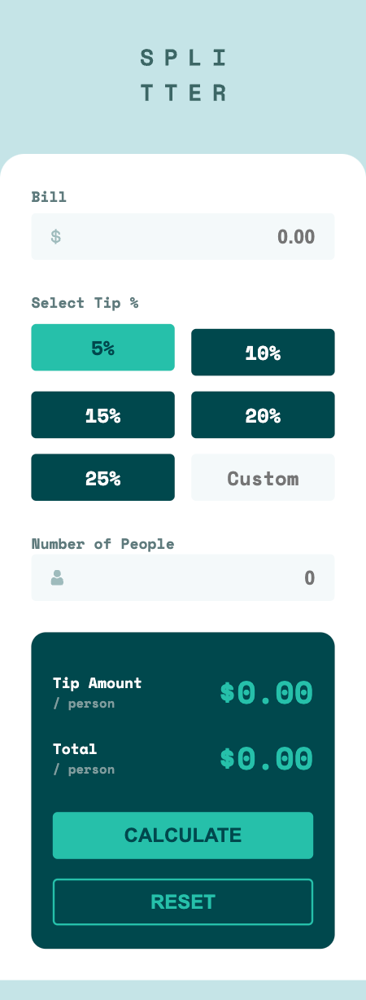
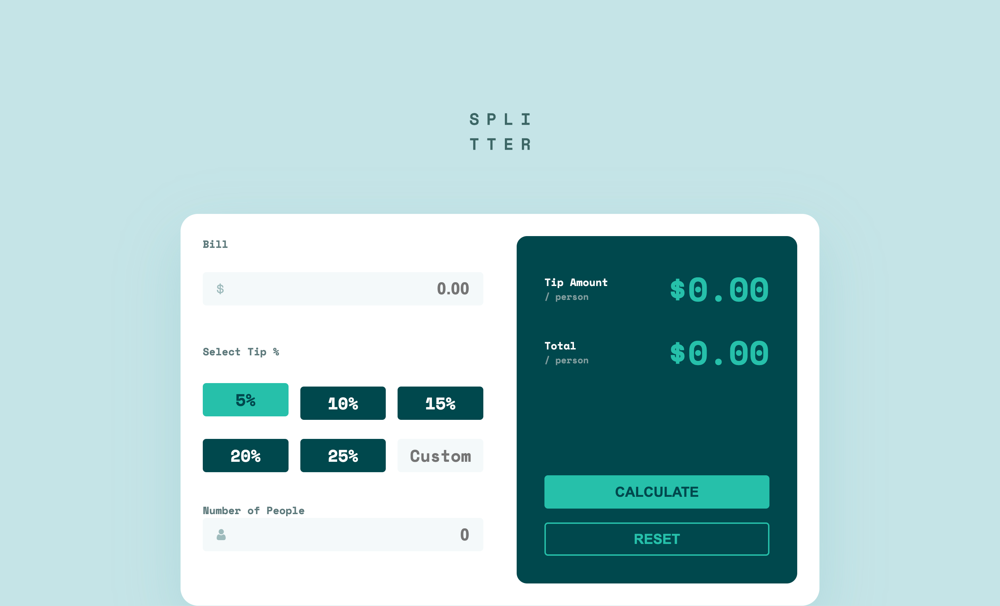

# Frontend Mentor - Tip calculator app solution

This is a solution to the [Tip calculator app challenge on Frontend Mentor](https://www.frontendmentor.io/challenges/tip-calculator-app-ugJNGbJUX). Frontend Mentor challenges help you improve your coding skills by building realistic projects.

## Table of contents

- [Overview](#overview)
  - [The challenge](#the-challenge)
  - [Screenshot](#screenshot)
  - [Links](#links)
- [My process](#my-process)
  - [Built with](#built-with)
  - [What I learned](#what-i-learned)
  - [Continued development](#continued-development)
  - [Useful resources](#useful-resources)
- [Author](#author)

## Overview

### The challenge

Users should be able to:

- View the optimal layout for the app depending on their device's screen size
- See hover states for all interactive elements on the page
- Calculate the correct tip and total cost of the bill per person

### Screenshot




### Links

- Solution URL: [Github](https://github.com/delroscol98/Tip-Calculator-App)
- Live Site URL: [Github Pages](https://delroscol98.github.io/Tip-Calculator-App/)

## My process

### Built with

- Semantic HTML5 markup
- CSS custom properties
- Flexbox
- CSS Grid
- Mobile-first workflow

### What I learned

In this project I learned:

- The importance of breaking down larger functions into smaller functions to separate concerns and keep code clean and easy to debug.

Below are some code snippets I'm proud of:

```js
function restrict(tis, regex) {
  // data-prev attribute is retrieved from the input and placed in a variable called prev
  let prev = tis.getAttribute("data-prev");

  // If the value of data-prev is non empty leave it, otherwise set it to an empty string
  prev = prev != "" ? prev : "";

  // If the value of the input matches the passed in Regular Expression then the value of the input is set to data-prev
  if (!tis.value.match(regex)) tis.value = prev;

  // Sets the value of the data-prev attribute to the value of the string
  tis.setAttribute("data-prev", tis.value);
}
```

### Continued development

As project become more complex it's important to use documentation to make my code readable for other developers and future self.

### Useful resources

- [Youtube](https://www.youtube.com/watch?v=YK-GurROGIg&t=631s) - This video helped me to get started with JSDoc

## Author

- Frontend Mentor - [@delroscol98](https://www.frontendmentor.io/profile/delroscol98)
